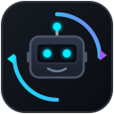

<p align="center">
  
</p>

# OpenCode Models for Copilot (`opencode-copilot-sync`)

[](https://github.com/mfenderov/opencode-copilot-sync/actions/workflows/ci.yml)
[](LICENSE)
[](https://github.com/mfenderov/opencode-copilot-sync/releases)

A lightweight VS Code extension that automatically synchronizes model catalogs from **OpenCode Go** and **OpenCode Zen** into GitHub Copilot in VS Code under a **single unified provider** with **smart cost-optimized routing**. Its HTTP client is bundled into the extension package.

---

## ✨ Features

- **🔄 Automatic Background Sync**: Activates seamlessly on `onStartupFinished` when VS Code opens or window reloads.
- **📊 Usage & Quotas Sidebar**: Live view in the Activity Bar showing real-time Go subscription limits (5-hour rolling, weekly, monthly countdowns), model catalog counts, and quick actions.
- **🛡️ Silent Stall Auto-Recovery**: Automatically detects zero-byte stream hangs on upstream proxy connections and recovers with a fresh request ID before erroring.
- **🎯 Single Unified Provider (`OpenCode`)**: All Go, Zen Free, and Zen-exclusive models appear together under a single clean "OpenCode" entry in Copilot's model picker with zero duplicate clutter.
- **💰 Smart Cost-Optimized Routing**:
  - Any model covered by the **OpenCode Go flat subscription** (e.g. DeepSeek V4, GLM-5.3, Kimi K3, Qwen 3.8, MiniMax M3) routes to `/zen/go/v1/chat/completions` ($0 per-token).
  - Free-tier models (`deepseek-v4-flash-free`, `mimo-v2.5-free`, `nemotron-3-ultra-free`, `big-pickle`) and Zen-exclusive models (Claude, GPT, etc.) route to `/zen/v1/chat/completions`.
  - In cases of overlap, Go flat-rate takes priority—protecting you from paying per-token charges for models already included in your Go plan.
- **🔑 Secure Credential Storage**: Stores your API key safely in VS Code's encrypted OS credential vault (`context.secrets`) without scanning arbitrary files on disk. If missing, prompts securely with direct links to [opencode.ai](https://opencode.ai).
- **⚡ Enriched Capabilities**: Configures each model with token limits, vision flags, tool calling, and thinking/reasoning effort levels (`low`, `medium`, `high`, `xhigh`, `max`).
- **🛡️ Router Compliance**: Injects the required `x-opencode-session` header on every request to ensure OpenCode's routing and prompt caching function correctly without `MissingSessionID` errors. Live chat requests get a stable ID reused for the whole conversation (not regenerated per turn), so prompt caching actually kicks in.
- **🔒 Safe & Non-Destructive**: Merges into `chatLanguageModels.json` while preserving your other custom endpoints (like internal gateways or LiteLLM) and creating rolling timestamped backups.
- **💻 Cross-Platform**: Works on macOS, Linux, Windows, and Windows WSL (configured with `extensionKind: ["ui", "workspace"]`).

---

## 🚀 Quick Install

### Option A: Install from GitHub Release (Recommended)
1. Download `opencode-copilot-sync-0.17.4.vsix` from the [Latest Release](https://github.com/mfenderov/opencode-copilot-sync/releases/latest).
2. Install via terminal:
   ```bash
   code --install-extension opencode-copilot-sync-0.17.4.vsix
   ```
   Or in VS Code: Extensions view (`Ctrl+Shift+X` / `Cmd+Shift+X`) → `...` menu → **Install from VSIX...**

### Option B: Build from Source
```bash
git clone https://github.com/mfenderov/opencode-copilot-sync.git
cd opencode-copilot-sync
npm ci
npm run package
code --install-extension opencode-copilot-sync-*.vsix
```

### Dependencies

- Requires VS Code `1.125` or later.
- Building, testing, and packaging from source requires Node.js and npm. `npm ci` installs the locked runtime and development dependencies, including `undici` and the build/test tools.
- `npm run package` bundles the HTTP client into the VSIX; end users do not need to install a separate runtime package.

---

## ⚙️ Configuration Settings

Customize behavior via VS Code Settings (`Cmd+,` / `Ctrl+,` search for `opencode`):

| Setting | Default | Description |
| :--- | :--- | :--- |
| `opencode.autoSyncOnStartup` | `true` | Automatically sync models on VS Code launch or window reload. |
| `opencode.includeGoModels` | `true` | Include models from the OpenCode Go subscription catalog. |
| `opencode.includeZenModels` | `true` | Include Zen models (Free tier + Zen exclusive models). |
| `opencode.additionalSyncTargets` | `[]` | Additional absolute `chatLanguageModels.json` paths to mirror to. Use this to opt in to another user profile or a sibling WSL distro. |
| `opencode.streamIdleTimeoutSeconds` | `90` | Watchdog timeout in seconds before auto-recovering or alerting on an idle stream. |

---

## 🕹️ Commands, Status Bar & Sidebar

- **Activity Bar View**: Click the **OpenCode** hubot icon in the left Activity Bar to see:
  - 📊 Real-time Go subscription quotas (rolling 5-hour, weekly, monthly limits & reset timers)
  - 🏷️ Active model counts (OpenCode Go flat-rate vs Zen Free tier)
  - ⚡ Quick actions to sync models, update API key, and open config
- **Status Bar Indicator**: Click `$(hubot) OpenCode` in the bottom-right status bar to trigger a live sync with spin animation.
- **Command Palette** (`Cmd+Shift+P` / `Ctrl+Shift+P`):
  - `OpenCode: Sync Models to Copilot`: Manually fetch models and refresh Copilot.
  - `OpenCode: Refresh Usage`: Refresh Go subscription limits in status bar and sidebar view.
  - `OpenCode: Set API Key`: Update your OpenCode API key securely.
  - `OpenCode: Open Copilot Models Config`: Open `chatLanguageModels.json` in editor.

---

## 🪟 Windows & WSL Usage

- The active extension stores its API key in that VS Code extension host's encrypted `SecretStorage`. An explicitly supplied `OPENCODE_API_KEY` environment variable is also supported (commonly for CI); the extension and E2E tests do not scan OpenCode `auth.json` files.
- Automatic compatibility targets are limited to the current OS user's existing VS Code profiles and the WSL distro explicitly associated with the current VS Code remote window. Other user homes and sibling distros are not discovered. Add exact absolute config-file paths to `opencode.additionalSyncTargets` to opt in to more targets.
- A compatibility mirror never receives the extension's raw API key. VS Code resolves custom endpoint keys through a target-local SecretStorage reference such as `${input:chat.lm.secret.<id>}`. A profile without its own VS Code-generated reference is skipped and reported in the **OpenCode Copilot Sync** output channel. To enable that mirror, configure OpenCode in that profile through **Manage Language Models** and enter the key there; the next sync will preserve and reuse that profile's reference.

### Remote-SSH, Dev Containers & GitHub Codespaces

The extension's `extensionKind: ["ui", "workspace"]` setting asks VS Code to activate it on the same host as Copilot Chat in every remote topology, so Remote-SSH, Dev Containers, and Codespaces are expected to work the same way as WSL. These topologies aren't part of the automated test matrix yet (only WSL is), so treat them as **best-effort**: if sync doesn't pick up your models, run **`OpenCode: Sync Models to Copilot`** manually and check the **OpenCode Copilot Sync** output channel (`View → Output → OpenCode Copilot Sync`) for the logged `Remote: <name>` line, which confirms which host the extension actually activated on.

### Known limitation: Agents window under Remote-WSL

OpenCode models show up correctly in **Manage Language Models** and work fine in the regular **Copilot Chat view** under Remote-WSL. However, they currently do **not** appear in the model picker inside the **Agents window** (the standalone agentic session UI) when the workspace is opened via Remote-WSL.

This is a confirmed upstream VS Code limitation, not a bug in this extension: under Remote-WSL, the Agent Host process communicates over a remote path where the BYOK (Bring-Your-Own-Key) bridge is currently hardcoded as unavailable, regardless of which extension registers the model. It affects **every** BYOK/custom-endpoint provider under WSL, not just OpenCode. Tracked upstream in [microsoft/vscode#332085](https://github.com/microsoft/vscode/issues/332085) — a VS Code team member confirmed "Support for WSL is added to the backlog," with no ETA. Plain Windows and Dev Containers are unaffected.

---

## 🛠️ How It Works Under the Hood

VS Code Copilot natively reads custom OpenAI-compatible models from `chatLanguageModels.json` under the `customendpoint` vendor. VS Code file-watches this JSON and immediately updates Copilot's model picker whenever the file changes.

This extension connects to OpenCode's catalog APIs (`/zen/go/v1/models` and `/zen/v1/models`), transforms them into valid `customendpoint` specs with the proper `x-opencode-session` header, and atomically merges them into the current user's existing VS Code profiles and any explicitly associated WSL target.

In addition, the extension registers a **native** `opencode` Language Model Chat Provider directly with VS Code's API (no `chatLanguageModels.json` involved) wherever it is running — this is the primary path, handled by the extension's own request/retry/error logic. Compatibility mirrors merge only the OpenCode provider into each destination and preserve unrelated providers. The local primary profile's duplicate custom endpoint is purged because the native provider already serves it. Other targets are updated only when their existing OpenCode entry contains that target's VS Code SecretStorage reference; raw API keys are never serialized or copied between profiles.

---

## 📄 License

MIT © Mark Fenderov
